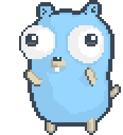

+++
date = '2025-05-30T14:10:12+02:00'
title = 'Introduction'
summary = "Article d'introduction pour la série sur le langage Go."
tags = ["Go","Series"]
series = ["Go"]
series_order = 1
+++

## Introduction à la Programmation avec Go

Bienvenue dans cette nouvelle série d'articles dédiée à l'exploration du langage de programmation Go. Développé par Google, Go est un langage moderne qui a rapidement gagné en popularité grâce à sa simplicité, son efficacité et sa capacité à gérer la programmation concurrente de manière élégante.


**Attention!** Cette série d'articles n'a pas pour vocation à être un véritable cours ou tutoriel.


## Pourquoi Go ?

Go, au-delà d'être mon langage préféré, a été conçu pour répondre aux besoins des développeurs travaillant sur des projets de grande envergure, nécessitant une exécution rapide et une gestion efficace des ressources. Voici quelques raisons pour lesquelles Go est devenu un choix privilégié pour de nombreux développeurs :

- **Simplicité** et Lisibilité : La syntaxe de Go est épurée et facile à apprendre, ce qui permet aux développeurs de se concentrer sur la résolution de problèmes plutôt que sur les complexités du langage.

- **Performance** : Go offre des performances comparables à celles des langages compilés comme C ou C++, tout en maintenant une syntaxe simple et un environnement de développement convivial.

- **Concurrency** : Avec ses goroutines et ses canaux, Go simplifie la gestion de la concurrence, permettant aux développeurs de créer des applications hautement performantes et réactives.

- **Bibliothèque** Standard Riche : Go est livré avec une bibliothèque standard complète qui couvre un large éventail de fonctionnalités, des opérations d'entrée/sortie aux manipulations de réseaux, en passant par le cryptage et bien plus encore.

## À Quoi S'attendre dans Cette Série ?

Dans les articles à venir, je vais explorer les différentes facettes de Go. Voici un aperçu de ce que vous pourrer trouver :

1. **Les Fondamentaux de Go**
2. **La Programmation Concurrentielle**
3. **La Bibliothèque Standard**
4. **Les Bonnes Pratiques et les Outils**
5. **Études de Cas et Projets**

